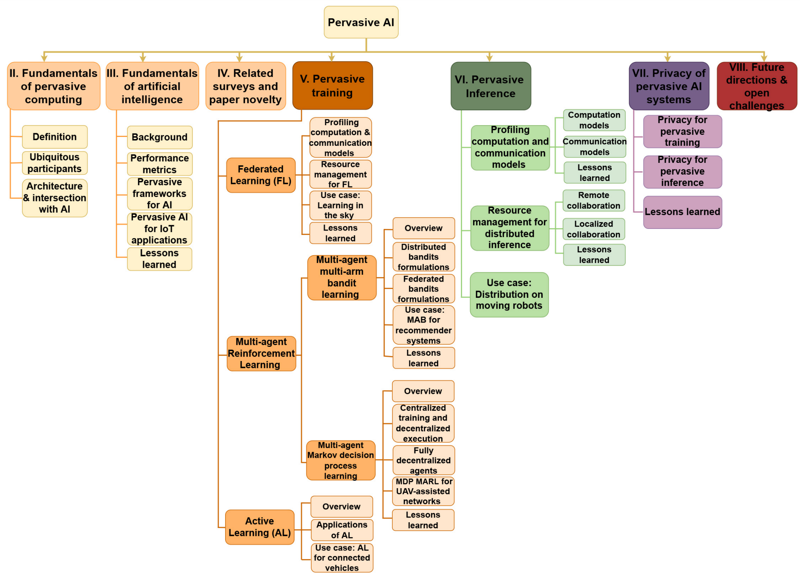

# Pervasive AI for IoT applications: A survey on resource-efficient distributed artificial intelligence

\[[返回主页](../../README.md)\]

## 作者信息
*Emna Baccour (Hamad Bin Khalifa University), Naram Mhaisen, Alaa Awad Abdellatif (Qatar University), Aiman Erbad (Hamad Bin Khalifa University), Amr Mohamed (Qatar University), Mounir Hamdi (Hamad Bin Khalifa University), Mohsen Guizani (Mohamed Bin Zayed University of Artificial Intelligence)*

## 研究背景
AI为物联网提供了多样化的智能应用与服务，包括语音处理、视频监控等。本文从算法和系统的角度出发，针对普适AI系统（Pervasive AI Systems）进行了深入探讨。

## 主要贡献
该文章从普适计算与AI系统结合的角度，关注于面向泛在物联网的普适AI系统，包括普适AI训练（联邦学习、深度强化学习等）与AI推理（计算与通信优化、资源管理等）。进而，分析了普适AI系统下的隐私问题。

