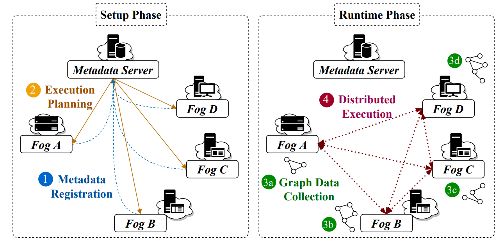

# [Fograph: Enabling real-time deep graph inference with fog computing](https://doi.org/10.1145/3485447.3511982)

\[[返回主页](../../README.md)\]

## 作者信息
*Liekang Zeng, Peng Huang, Ke Luo, Xiaoxi Zhang, Zhi Zhou, Xu Chen (Sun Yat-sen University)*

## 研究背景
图神经网络（Graph Neural Networks, GNNs）因其在图结构中提取潜在表示的出色能力，引起了越来越多的关注。为物联网驱动的智能应用提供基于GNN的服务，传统的模型服务范式依赖于将地理分布的输入数据完全上传到远程的云计算数据中心。然而，基于集中式的云计算服务会带来显著的通信开销。鉴于此，如何引入雾计算分布式模式，实现高效快速的GNN计算。

## 主要贡献
为了最大化雾计算带来的架构优势，该文献提出了一种分布式实时GNN推理框架Fograph，利用靠近物联网数据源的多雾节点的多样化资源。进而，通过引入异构感知执行规划和针对性的GNN压缩技术，Fograph根据分布式环境中GNN服务的特有属性设计执行调度算法。

