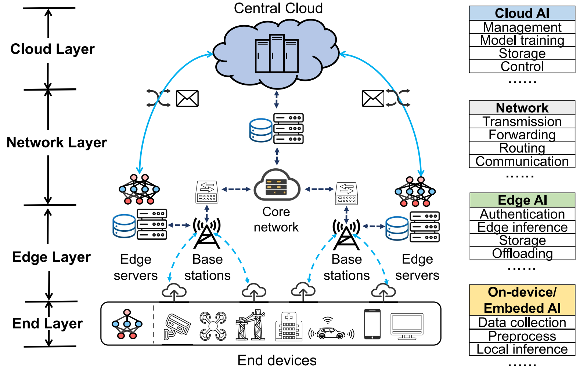

# [Distributed artificial intelligence empowered by end-edge-cloud computing: A survey]([content/2023/comst23-dis-ai-eecc.md](https://doi.org/10.1109/COMST.2022.3218527))

## 作者信息
*Sijing Duan, Dan Wang (Central South University), Ju Ren (Tsinghua University), Feng Lyu (Central South University), Ye Zhang (Beijing Information Science and Technology University), Huaqing Wu (University of Calgary), Xuemin Shen (University of Waterloo)*

## 研究背景
随着计算范式从集中式云向网络边缘侧下沉，该文章针对人工智能技术（AI）赋能的端-边-云计算进行了深入探讨。

## 主要贡献
主要关注端-边-云智能场景下机器学习模型的分布式训练与推理，主要包括边缘训练与推理的优化技术（如，模型并行、数据并行、混合并行等）。基于此，分析了分布式训练与推理所遇到的潜在隐私问题与安全威胁，具体分为模型安全、数据安全、接入安全，以及推理运行时隐私等。

