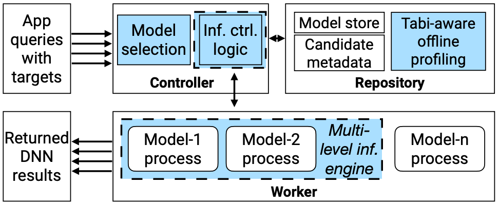

# [Tabi: An Efficient Multi-Level Inference System for Large Language Models](https://doi.org/10.1145/3552326.3587438)

\[[返回主页](https://github.com/withhaotian/awesome-edge-AI-papers.git)\]

## 作者信息
*Yiding Wang, Kai Chen (iSING Lab, Hong Kong University of Science and Technology), Haisheng Tan (University of Science and Technology of China), Kun Guo (Fuzhou University)*

## 研究背景
随着大语言模型(LLM)的应用越来越广泛，研发人员通过构建更多参数、更深层数的模 型以获得更优的性能表现。伴随着 LLM 计算复杂度的的增加，推理阶段的高计算开销将导致高 延迟。如何在保障推理准确率的同时，有效提升推理系统的效率，是该文章试图解决的关键问 题。

## 主要贡献
本文设计了一个支持多层级的推理系统——Tabi。该系统的主要技术贡献点包括: 1)在注意力 中，对于大多数的查询操作，较小的模型可以实现与 LLM 近似的预测性能。因此，Tabi 使用基 于小模型和可调整结构的 LLM 为推理任务提供查询服务; 2)Tabi 引入了可校准置信度分数的 提前退出分支结构，自适应调整 LLM 推理任务的计算复杂度，从而进一步加速推理延迟; 3) 针对重路由查询，Tabi 提出了一种基于注意力的词剪枝和加权集成技术以避免额外的系统开销和精度损失。

