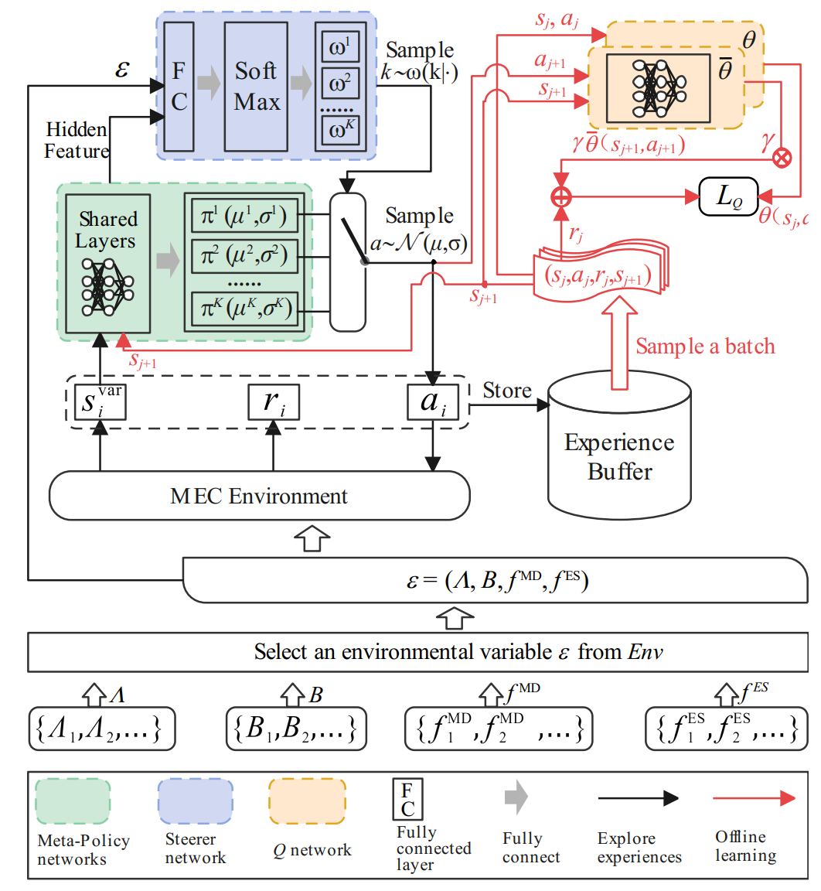

# [FEAT: Towards Fast Environment-Adaptive Task Offloading and Power Allocation in MEC](https://doi.org/10.1109/INFOCOM53939.2023.10228946)

## 作者信息
*Tao Ren (Institute of Software Chinese Academy of Sciences), Zheyuan Hu, Hang He, Jianwei Niu, Xuefeng Liu (Beihang University)*

## 研究背景
现有基于深度强化学习（Deep Reinforcement Learning，DRL）的任务卸载和功率分配方法在移动边缘计算（Mobile Edge Computing，MEC）环境中缺乏对未知环境的适应性，导致性能下降。现有的DRL方法都是在特定环境下开发的，缺乏对未知环境的适应性。鉴于此，该文献旨在解决上述挑战，实现DRL智能体在少量微调的情况下适应未知环境。

## 主要贡献
该文献提出了一种基于DRL的任务卸载和功率分配方法——FEAT，旨在解决现有DRL智能体在未知环境下适应性差的问题。具体而言，FEAT将MEC状态分为内部状态和环境状态，并基于上述两种状态设计了两组关键模块，分别为1）内部状态相关的TOPA元策略；2）嵌入环境状态的控制器。TOPA元策略在内部状态空间中学习决策信息，而控制器则根据嵌入的环境状态选择适当的元策略。

