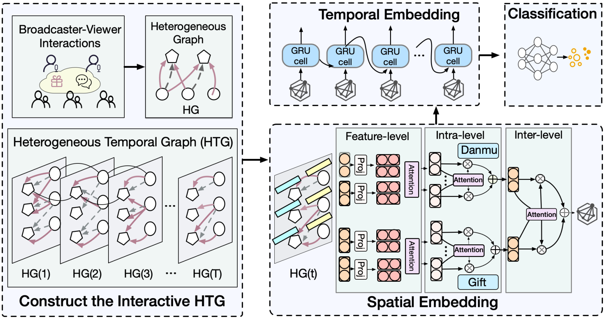

# [Who is the Rising Star? Demystifying the Promising Streamers in Crowdsourced Live Streaming](https://doi.org/10.1109/INFOCOM53939.2023.10228881)

\[[返回主页](../../README.md)\]

## 作者信息
*Rui-Xiao Zhang, Tianchi Huang (BNRist Key Laboratory of Pervasive Computing, Tsinghua University), Chenglei Wu (Tencent), Lifeng Sun (BNRist Key Laboratory of Pervasive Computing, Tsinghua University)*

## 研究背景
针对网络在线直播，如何获取并分析在线视频流的复杂异构数据特征（内部与外部数据因素，如播放时长、观看人数等），并在较早阶段就发现更具有潜力的新兴主播，帮助视频平台更好地服务用户。

## 主要贡献
传统的时序预测模型难以解决直播视频流的交互性以及异构性问题。因此，该文章提出了一种基于图神经网络的解决方案 Niffler。该模型包括两大模块：1）通过结合图神经网络与循环单元结构，Niffler 模型可以同时捕获交互性特征和数据间的时变性特征；2）将注意力机制引入Niffler模型中，实现在感知不同层次的节点表示时保持异构性。

