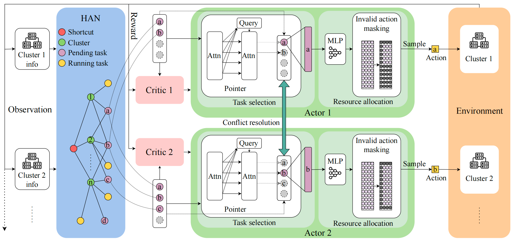

# [Tapfinger: Task placement and fine-grained resource allocation for edge machine learning](https://doi.org/10.1109/INFOCOM53939.2023.10229031)

\[[返回主页](../../README.md)\]

## 作者信息
*Yihong Li, Tianyu Zeng, Xiaoxi Zhang (Sun Yat-sen University), Jingpu Duan (Peng Cheng Laboratory), Chuan Wu (The University of Hong Kong)*

## 研究背景
边缘计算扩展了云计算的能力，能够提高服务质量（Quality of Services，QoS）和数据隐私保护。然而，由于边缘设备的资源有限，高效地利用这些资源来优化边缘机器学习（Machine Learning，ML）任务的性能变得至关重要。现有的边缘-云调度器通常基于预设规则分配资源，但无法根据实际需求和供应灵活地优化任务性能。此外，在资源估算和分配方面存在不确定性和弹性，并且难以实现细粒度的资源分配和任务安排，从而无法最大化边缘ML任务的整体性能。鉴于此，该文献旨在研究如何在多集群边缘网络中，通过联合优化任务安置和细粒度多资源分配，最小化边缘计算网络中的ML任务总完成时间。

## 主要贡献
该文献提出了一种基于多智能体强化学习（MARL）的分布式调度器TapFinger，最小化ML任务的总完成时间。具体而言，1）基于MARL技术，TapFinger能够更好地处理任务特征的多样性和边缘网络的复杂性，即每个智能体代表一个边缘集群，通过合作和信息共享来优化全局资源效率；2）利用异构图注意网络（HAN）编码不同边缘组件及其依赖关系的丰富语义信息，提高智能体的学习能力；3）通过指针网络模块，将任务选择和资源分配分解为多个步骤，从而处理复杂的任务编排，并基于贝叶斯定理以协调不同智能体的决策，避免资源竞争冲突。

