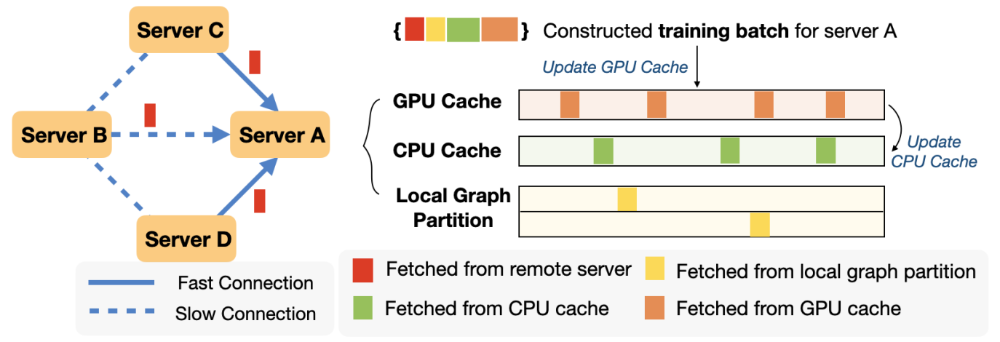

# [Two-level Graph Caching for Expediting Distributed GNN Training](https://doi.org/10.1109/INFOCOM53939.2023.10228911)

\[[返回主页](https://github.com/withhaotian/awesome-edge-AI-papers.git)\]

## 作者信息
*Zhe Zhang, Ziyue Luo, Chuan Wu (Department of Computer Science, The University of Hong Kong)*

## 研究背景
随着图神经网络的广泛应用，通常采用分布式训练模式，即将图结构的子节点分散在多个计算节点执行训练任务。然而，针对分布式图神经网络的模型训练过程，主要的训练性能瓶颈在于跨计算节点的的图特征提取，其占据每个训练迭代的主要训练延迟开销。因此，如何实现高效的动态图特征缓存，从而加速分布式图神经网络训练，是该文章拟解决的关键问题。

## 主要贡献
针对动态图特征缓存问题，提出了一种两级在线图特征缓存算法，旨在提升图神经网络的训练性能。具体而言：1）支持 CPU 与 GPU 混合异构的图神经网络训练任务加速算法；2）实现了邻接训练节点间特征缓存数据的协同交互，以及基于两级缓存（即硬件级缓存与交互级缓存）的动态节点调度。

