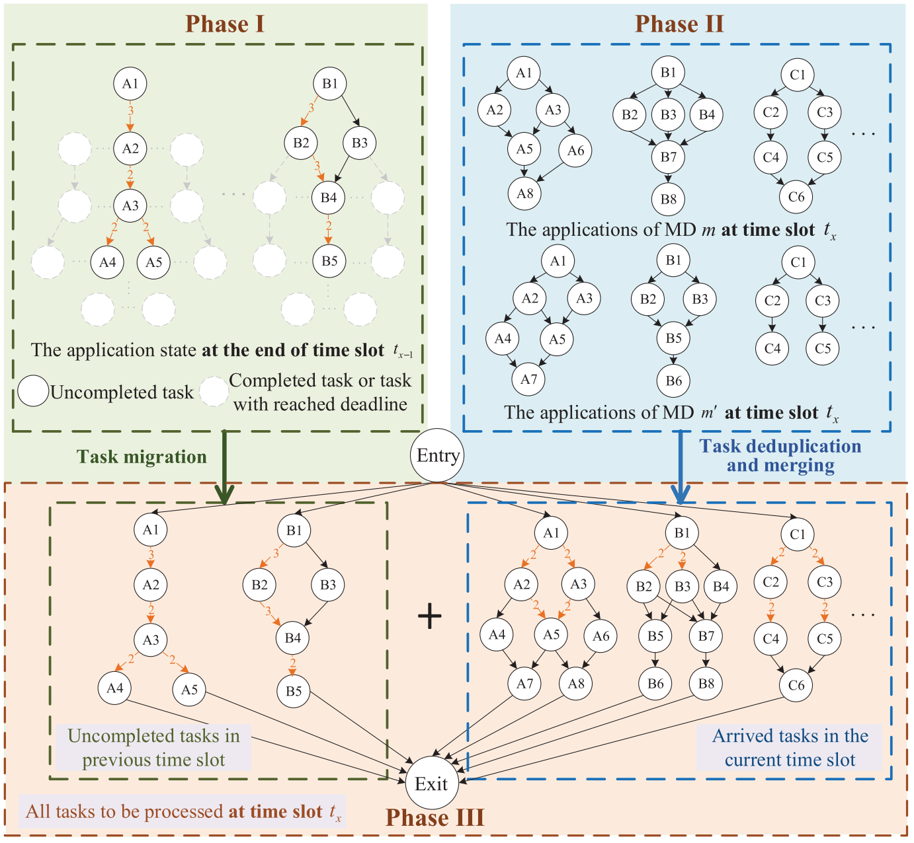

# [Dependent task scheduling and offloading for minimizing deadline violation ratio in mobile edge computing networks](https://doi.org/10.1109/JSAC.2022.3233532)

\[[返回主页](../../README.md)\]

## 作者信息
*Shumei Liu, Yao Yu, Xiao Lian, Yuze Feng (Northeastern University), Changyang She, Phee Lep Yeoh (The University of Sydney), Lei Guo (Chongqing University of Posts and Telecommunications), Branka Vucetic, Yonghui Li (The University of Sydney)*

## 研究背景
移动边缘计算将计算任务从移动设备卸载到边缘服务器，可以提供更低延迟和更高计算能力。然而，在任务计算卸载过程中，需要考虑任务优先级约束和部分卸载模式，以及在多个移动设备和边缘服务器之间进行顺序调度和并行计算决策。因此，本文针对移动边缘计算环境下具有执行依赖的任务卸载，解决了在未知任务到达率下的本地与边缘联合卸载问题。

## 主要贡献
文章提出了一种基于 DDPG（Deep Deterministic Policy Gradient）的计算任务卸载算法，将卸载问题转化为最大化奖励。具体而言，考虑了任务优先级约束和部分卸载模式，并通过联合优化顺序调度和并行计算决策以优化计算执行。

