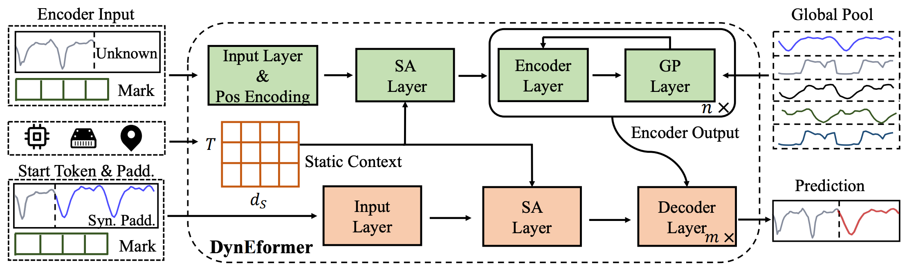

# [One for All: Unified Workload Prediction for Dynamic Multi-tenant Edge Cloud Platforms](https://dl.acm.org/doi/abs/10.1145/3580305.3599453)

\[[返回主页](https://github.com/withhaotian/awesome-edge-AI-papers.git)\]

## 作者信息
*Shaoyuan Huang, Zheng Wang, Heng Zhang, Xiaofei Wang (Tianjin University), Cheng Zhang (Tianjin University of Finance &
Economics), Wenyu Wang (Paiou Cloud Computing (Shanghai) Co., Ltd)*

## 研究背景
针对多租户边缘云平台（MT-ECP）中服务器的工作负载预测任务。由于MT-ECP存在异质性的应用运行模式、差异化的基础设施性能和频繁的应用部署，给应用工作负载预测带来了极大挑战。

## 主要贡献
该文章提出了一个具有全局池化和静态内容感知的端到端框架DynEformer，为动态MT-ECP提供了一个统一的工作负载预测方案。DynEformer不仅在MT-ECP的动态场景中将动态负载预测准确率平均提高42%，还实现了较高的鲁棒性，能为云计算与边缘云计算平台提供有效的通用负载预测。

