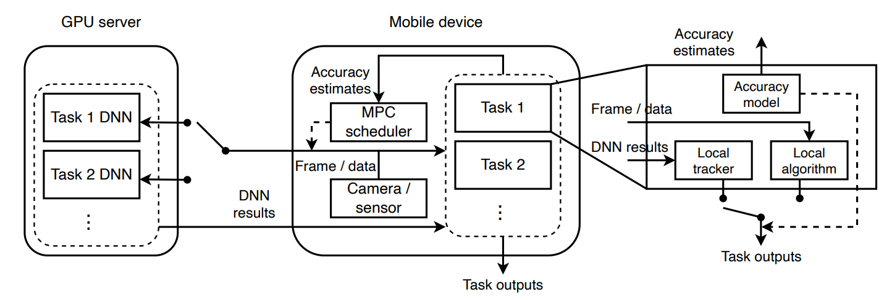

# [AccuMO: Accuracy-centric multitask offloading in edge-assisted mobile augmented reality](https://doi.org/10.1145/3570361.3592531)

\[[返回主页](../../README.md#2023)\]

## 作者信息
*Z. Jonny Kong, Qiang Xu, Jiayi Meng, Y. Charlie Hu (Purdue University)*

## 研究背景
沉浸式应用程序（如增强现实AR和混合现实MR）通常需要在每帧摄像头捕获的画面上执行多个对延迟敏感的任务，这些任务都需要在当前帧间隔内获得结果。现有工作往往考虑将单个DNN任务卸载至边缘服务器。然而，针对沉浸式应用而言，通常表现为频繁的高并发请求模式。因此，如何同时将多任务卸载至资源共享的边缘服务器，并做到工作负载均衡，仍然面临技术挑战。

## 主要贡献
该论文提出了一种准确率驱动的多任务卸载框架AccuMO，以动态调度多DNN卸载任务，从而实现跨任务的准确率提升。具体而言，AccuMO包含两部分：1）任务特定的轻量化预测模型，预先预测卸载准确率的下降率；2）两阶段控制反馈循环，以并发均衡卸载任务并自适应决策卸载算法与本地算法。

