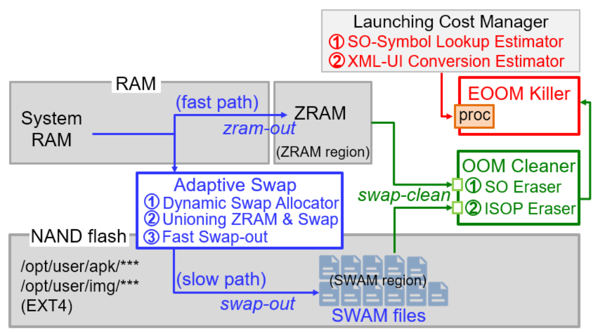

# [SWAM: Revisiting Swap and OOMK for Improving Application Responsiveness on Mobile Devices](https://doi.org/10.1145/3570361.3592518)

## 作者信息
*Geunsik Lim (Sungkyunkwan University), Donghyun Kang (Gachon University), MyungJoo Ham (Samsung Electronics), Young Ik Eom (Sungkyunkwan University)*

## 研究背景
移动设备上传统的内存回收机制，如内存交换和应用程序终止，会对正在运行的应用程序的响应时间产生负面影响。鉴于此，如何优化移动设备上的内存管理，包括内存交换与应用终止，以提高应用程序的响应性能，是该论文主要解决的科学问题。

## 主要贡献
该论文提出了一种集成内存管理技术SWAM，以提高移动设备上的应用响应能力。具体而言，为了解决移动设备上传统内存交换与应用程序终止的缺陷，分别提出了三个关键组件：1）自适应内存交换，即自适应切换至内存或持久性存储设备中；2）OOM清理器，回收交换空间中的共享对象页面；3）EOOM终止器，在最坏的情况下终止进程，但首先优先选择初始化成本最低的应用程序进行进程终止。

