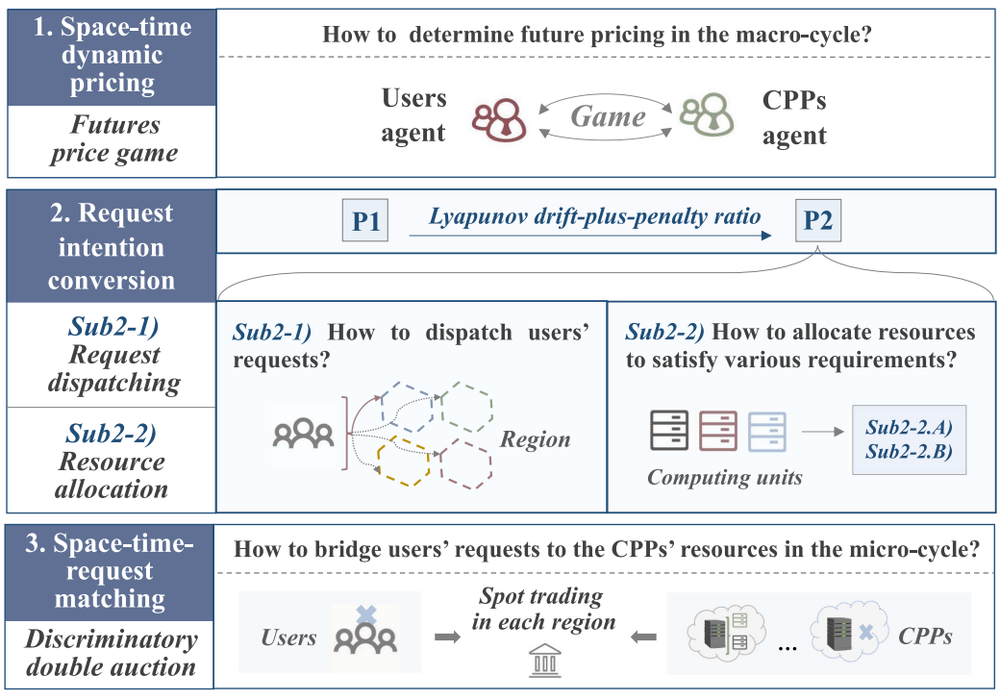

# [CompCube: A Space-Time-Request Resource Trading Framework for Edge-Cloud Service Market](https://doi.org/10.1109/TSC.2023.3261553)

\[[返回主页](../../README.md#2023)\]

## 作者信息
*Xiaoxu Ren, Chao Qiu, Zheyuan Chen, Xiaofei Wang (Tianjin University), Dusit Niyato (Nanyang Technological University), Wenyu Wang (Shanghai Zhuichu Networking Tecnologies Company, Ltd.,)*

## 研究背景
人工智能的快速发展，使得边缘服务市场（包括提供者与用户）对于计算等资源的需求趋向于多样化与复杂化。因此，如何在平衡成本和用户服务水平协议（SLA）的同时，动态地确定地理上分散的计算资源的价格和配置是一个具有挑战性的问题。

## 主要贡献
该文章提出了一种面向边缘服务市场的时空请求交易框架CompCube。为了保证服务供给与交易的稳定性，CompCube采用了双时间尺度的服务定价与资源分配策略：宏周期（macro-cycle）的时空动态定价、微周期（micro-cycle）的请求意图转换、微周期的资源匹配等双循环的期货-现货交易方式。

