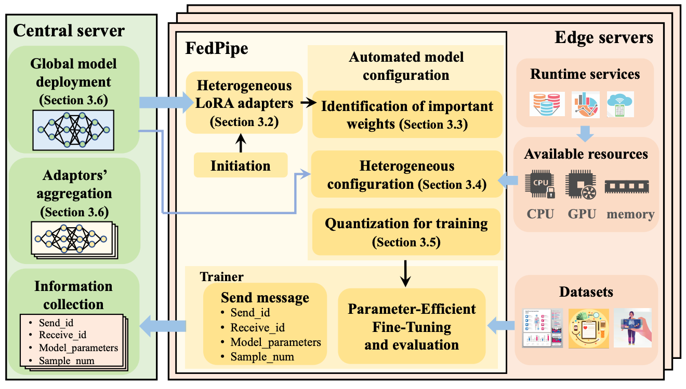

# [Automated Federated Pipeline for Parameter-Efficient Fine-Tuning of Large Language Models](https://arxiv.org/pdf/2404.06448)

\[[返回主页](../../README.md)\]

## 作者信息
*Zihan Fang, Zheng Lin, Zhe Chen (Fudan University), Xianhao Chen (University of Hong Kong), Yue Gao (Fudan University), Yuguang Fang (City University of Hong Kong)*

## 研究背景
文章试图解决的问题是如何在具有异构计算资源的边缘服务器上，以参数高效的方式对大型语言模型（LLM）进行联邦学习微调。具体来说，面临的挑战包括：1）大型语言模型的尺寸和计算需求。大型语言模型（如GPT-3）拥有巨大的参数量，这导致在边缘服务器上直接微调这些模型需要大量的计算资源和通信开销；2）边缘服务器的资源异构性。在边缘计算环境中，不同的服务器可能拥有不同的计算能力和网络资源，这增加了微调大型语言模型的复杂性。

## 主要贡献
本文提出了一中自动化的联邦学习微调流水线框架——FedPipe，旨在优化大型语言模型的微调过程，具体包括：1）通过分析模型权重对训练的贡献来确定需要微调的权重；2）通过低秩适配器配置，为选定的权重配置低秩适配器，以减少每个边缘服务器上的训练负载；3）根据边缘服务器的内存要求对模型参数进行量化，以减少内存占用。

