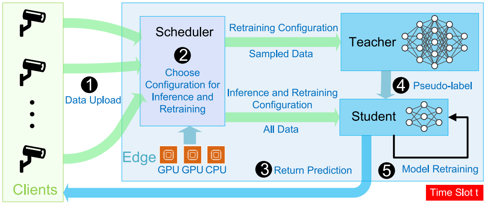

# Online Resource Allocation for Edge Intelligence with Colocated Model Retraining and Inference

\[[返回主页](../../README.md)\]

## 作者信息
*Huaiguang Cai, Zhi Zhou, Qianyi Huang (Sun Yat-Sen University)*

## 研究背景
边缘智能的兴起推动AI模型从云端下沉到边缘，以服务广泛的终端用户。然而，由于模型、数据和任务的动态漂移，部署在边缘智能环境中的AI模型在推理阶段会遭遇精度下降的问题。因此，需要定期对模型进行重训练以应对这些漂移。然而，在资源受限的边缘服务器上，同时进行模型重训练和推理任务时，如何在两者之间合理分配资源以最大化长期推理精度，面临着技术挑战。

## 主要贡献
该文献提出了一种轻量级且可解释的在线近似算法ORRIC，实现在资源受限的边缘服务器上优化模型重训练和推理任务的资源分配。首先，通过数学建模，ORRIC成功平衡了当前推理精度和未来推理精度之间的资源竞争关系，并证明其在数据漂移情况下的竞争比优于传统的仅推理（Inference-Only）方案。此外，ORRIC算法能够被转化为适用于不同资源环境的多种启发式算法，实验结果验证了在实际场景下的有效性。

