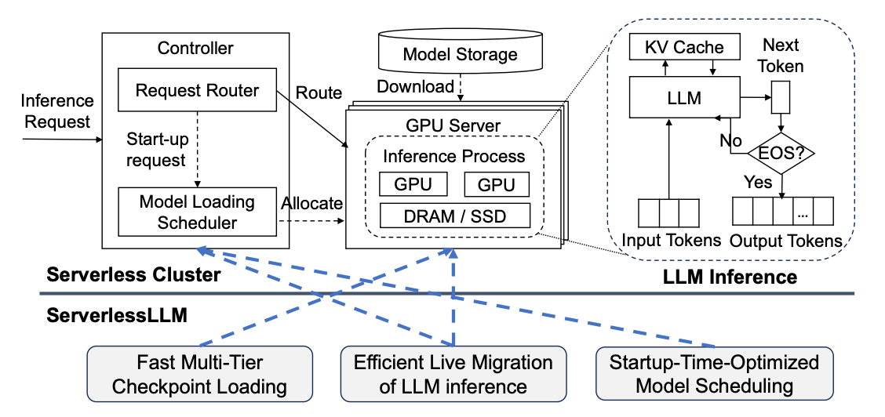

# [ServerlessLLM: Low-Latency Serverless Inference for Large Language Models](https://www.usenix.org/conference/osdi24/presentation/fu)

\[[返回主页](../../README.md#2024)\]

## 作者信息
*Yao Fu, Leyang Xue, Yeqi Huang, Andrei-Octavian Brabete (University of Edinburgh), Dmitrii Ustiugov (NTU Singapore), Yuvraj Patel, Luo Mai (University of Edinburgh)*

## 研究背景
随着大语言模型（LLM）在各种在线应用中的应用越来越广泛，如编程助手、搜索引擎和对话机器人，需要解决LLM推理的规模化和低延迟的挑战。面临的问题在于LLM推理需要大量的GPU资源，而且其延迟难以预测，对于提供商来说，需要托管大量的LLM，导致GPU消耗大，并且限制了用户的推理请求数量。

## 主要贡献
文章提出了一种增强局部性的无服务器推理系统——ServerlessLLM，通过利用GPU服务器上可用的存储和内存设备的容量和带宽，减少了昂贵的远程检查点下载，并实现了高效的检查点加载。具体而言，ServerlessLLM包括：1）通过新的加载优化检查点格式设计以及高效的多层检查点加载系统实现快速LLM检查点加载；2）通过局部化驱动的LLM推理与实时迁移，实现了在保持低延迟的同时有效地实现局部化驱动的服务器分配；3）通过局部感知的服务器分配，使ServerlessLLM能够评估集群中每个服务器的状态，并有效地安排模型启动时间以利用本地检查点位置。

