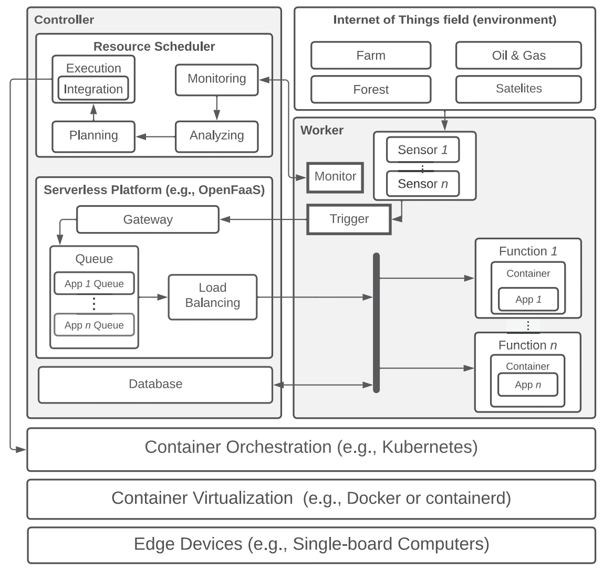

# [faasHouse: Sustainable Serverless Edge Computing through Energy-aware Resource Scheduling](https://doi.org/10.1109/TSC.2024.3354296)

\[[返回主页](https://github.com/withhaotian/awesome-edge-AI-papers.git)\]

## 作者信息
*Mohammad Sadegh Aslanpour, Adel N. Toosi, Muhammad Aamir Cheema (Monash University), Mohan Baruwal Chhetri (CSIRO’s DATA61)*

## 研究背景
将服务器无感知计算引入边缘计算网络中，能够有效提升开发的灵活性与可扩展性，并降低管理成本。然而，主流的服务器无感知计算框架，如OpenFaaS、KubeEdge等都无法实现对能耗的精准管控，难以应对边缘环境下终端设备的有限电池寿命约束。

## 主要贡献
该论文提出了一种能耗感知的调度框架faasHouse，以解决无服务器边缘计算中的动态能耗和负载管理问题。具体而言，faasHouse基于Kubernetes的设计理念，引入评分机制对边缘节点进行排序以评估最优选择集；进而，通过将决策问题构建为一种经典的房屋分配问题（House Allocation Problem），并设计了一种分配算法以解决函数的放置问题。

