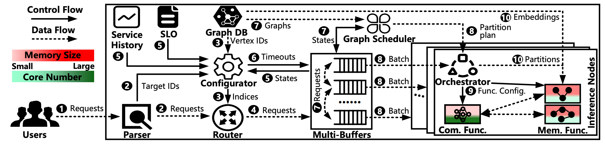

# [λGrapher: A Resource-Efficient Serverless System for GNN Serving through Graph Sharing](https://doi.org/10.1145/3589334.3645383)

\[[返回主页](https://github.com/withhaotian/awesome-edge-AI-papers.git)\]

## 作者信息
*Haichuan Hu, Fangming Liu, Qiangyu Pei, Yongjie Yuan (Huazhong University of Science and Technology), Zichen Xu (Nanchang University), Lin Wang (Paderborn University)*

## 研究背景
近年来，图神经网络（Graph Neural Networks, GNNs）在社交网络等Web应用中的图分析中得到了越来越广泛的采用。然而，由于工作负载波动大和GNN操作复杂，高效的GNN服务仍然是一个关键挑战。服务器无感知计算因其灵活性和敏捷性，提供了按需的GNN推理请求服务。然而，以请求为中心的服务器无感知模型仍然过于粗粒度，难以避免产生资源浪费。鉴于此，该文献主要解决GNN在服务器无感知计算系统下的执行效率低的问题。

## 主要贡献
鉴于请求的计算图中具有显著的数据局部性，该文献提出了一种用于GNN服务的服务器无感知系统λGrapher，通过图共享和细粒度资源分配来实现资源效率。𝜆λGrapher主要包含：1）自适应超时的请求缓冲，以平衡资源效率和推理延迟；2）基于图的调度，以最小化计算和内存冗余；3）基于资源的函数管理，通过细粒度资源分配来应对GNN计算的资源敏感性，并优化函数编排以缓解通信延迟。

