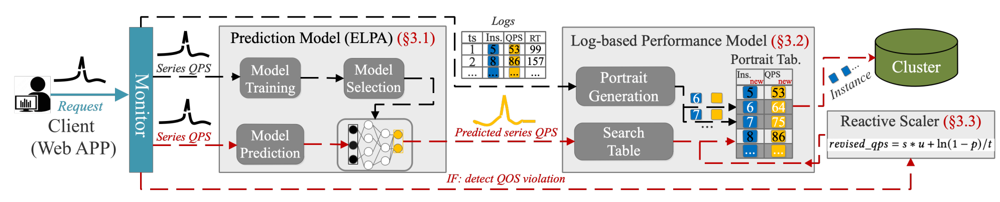

# [PASS: Predictive Auto-Scaling System for Large-scale Enterprise Web Applications](https://doi.org/10.1145/3589334.3645330)

## 作者信息
*Yunda Guo, Jiake Ge, Panfeng Guo, Yunpeng Chai (Renmin University of China), Tao Li, Mengnan Shi, Yang Tu, Jian Ouyang (Meituan)*

## 研究背景
近年来，云计算的快速增长促使越来越多的企业将网页应用托管在公共云（如Amazon EC2和Windows Azure）或由VMware Cloud、Mesos和Kubernetes等框架管理的私有云上。然而，现有的工作负载预测技术难以精确预测关键的流量变化，尤其是在峰值（Peak）状态。因此，如何实现大规模在线Web应用的工作负载精准预测与自动扩展，是该论文拟解决的科学问题。

## 主要贡献
本文提出了一种基于预测的自动扩展系统PASS，以应对企业Web应用的自动扩展。首先，基于单个应用的特征准确预测QPS（每秒查询率），以自适应工作负载多样性；其次，PASS通过基于历史日志构建的性能模型，并预测性地扩展到所需实例数量，同时保证不违反QoS需求。

