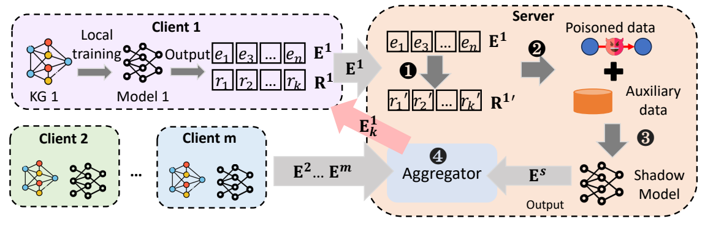

# [Poisoning Attack on Federated Knowledge Graph Embedding](https://doi.org/10.1145/3589334.3645422)

\[[返回主页](../../README.md)\]

## 作者信息
*Enyuan Zhou, Song Guo (Hong Kong Polytechnic University), Zhixiu Ma (Xidian University), Zicong Hong, Tao Guo, Peiran Dong (Hong Kong Polytechnic University)*

## 研究背景
联邦知识图谱嵌入（FKGE）作为一种新兴的协作学习技术，用于从分布式知识图谱中获取表示。在FKGE系统中，通常采用单服务器-多客户端的架构，客户端维护自己的知识图谱，服务器负责聚合来自不同客户端的实体嵌入并将其返回给各个客户端。然而，服务器和客户端都可能成为潜在的攻击者。鉴于此，该论文旨在如何设计一种投毒攻击方案，使FKGE系统在受害客户端的本地模型中添加虚假关系。

## 主要贡献
针对服务器发起的投毒攻击，该论文提出了两种基于差分隐私的防御机制，即DPSGD和DP-Flames，降低服务器的成员资格推断攻击，从而减弱其投毒攻击的效果。针对客户端发起的投毒攻击，提出了去中心化知识图谱嵌入的新范式，引入区块链代替中心化服务器来验证整个训练过程。在DKGE中，每个客户端都可以上传和下载嵌入更新，恶意参与者容易被受害者检测。

