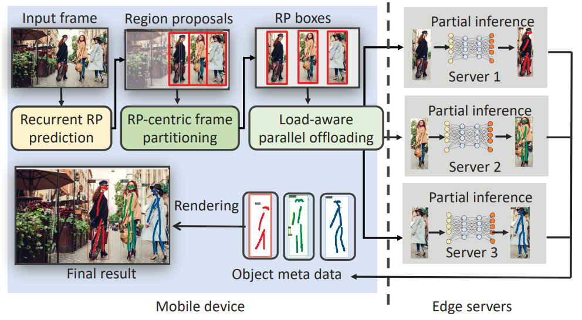

# Elf: accelerate high-resolution mobile deep vision with content-aware parallel offloading

\[[返回主页](../../README.md)\]

## 作者信息
*Wuyang Zhang (Rutgers University), Zhezhi He (Shanghai Jiao Tong University), Luyang Liu (Google Research), Zhenhua Jia (NVIDIA Corporation), Yunxin Liu (Microsoft Research), Marco Gruteser (Google Research), Dipankar Raychaudhuri (Rutgers University), Yanyong Zhang (University of Science and Technology of China)*

## 研究背景
在资源相对受限的移动设备上执行图像、视频处理等深度学习的推理任务，难以满足应用 实时需求。现有通过将推理任务卸载至边缘服务器的工作，仅仅考虑了单一的边缘服务器执行， 忽略了边缘服务器的并行计算。因此，该文章试图解决边缘服务器间的任务协同推理问题，并 支持当前主流的 2K、4K 等高分辨率图像。

## 主要贡献
作为首个支持高分辨率图像的移动视觉任务推理系统，Elf 分别从三个层面实现了终端 设备的推理任务加速:1)设计一种基于注意力机制的 LSTM 网络，实现内容感知的视频帧分割; 2)提出一种区域检索算法，解决了图像中跨越帧的追踪和任务首次出现匹配;3)通过动态评 估服务器的资源状态，实现推理任务的计算负载均衡。

